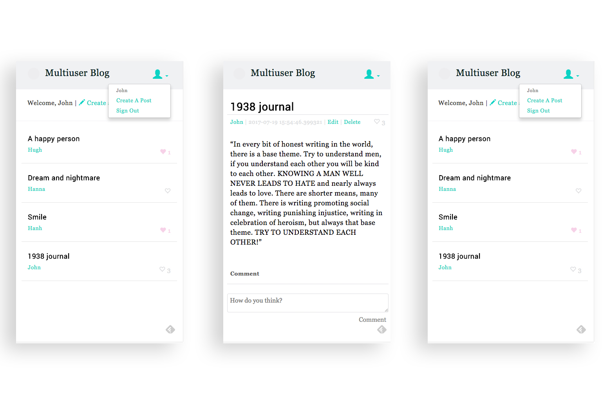

It's a  *blog* web app template, using [Google App Engine with Python](https://cloud.google.com/python/) and a Python template engine, [Jinja2](http://jinja.pocoo.org/).

You can find sample [here](https://blog-template-171415.appspot.com/)

This app includes..
- Main pages to layout all posts
- Page to layout individual users' all posts
- Page to show a post
- Sign up/sign in function
- Add/Edit/Delete posts function
- Add/Edit/Delete comments function
- Like/Unlike posts function




## File structure
- `src`: Resource folder
  - `app.yaml`: yaml file for Google App Engine
  - `main.py`: this python file imports modules and handles them
  - `settings.py`: containes site info, such as name, hash keys.
  - `handlers`: contains python files for jinja2 page handler
    - `templates`: containes templates html files for the generated site pages.
  - `models`: contains python files for app engine db model
  - `css`: This folder inludes css file(s) for the generated site pages.
  - `sass`: This folder includes sass file(s) to write css files.
  - `img`: This folder includes image files for the generated site pages. 
- `img`: This folder includes image files for this README.
- `Gruntfile.js`: It is to compile sass to css.
- `Gruntfile.yml`: Same as the above.
- `node_modules`: Same as the above.
- `package-lock.json`: Same as the above. 
- `package.json`: Same as the above.
- `README.md`
- `LICENCE.md`

## Set up
1. Install [Google Cloud SDK for Python](https://cloud.google.com/sdk/docs/quickstart-mac-os-x)
    * Make sure that you can use gcloud command
2. Run app locally with the following command in `src` folder.
```    
$ dev_appserver.py .
```
3. Check running at
- Module "default" running at: http://localhost:8080. 
- Admin server at: http://localhost:8000.

4. Install [Grunt](https://gruntjs.com/), if you want to use `Gruntfile.js` to run sass compiler.

## Usage

### [SECURITY] Modify hash codes for Security

##### Set SALT
You can modify the following in `settings.py` in `src`. 
```python
RANGE = 5
```

##### Set SECRET
You can modify the following in `settings.py` in `src`. 
```python
SECRET = 'your_secret_key'
```

##### Can change hash library
You can change hash methods in `util.py` in `src`/`handlers`.
```python
def hash_str(s):
    return hmac.new(SECRET, s).hexdigest()
``` python
and/or 
```
h = hashlib.sha256(name+pw+salt).hexdigest()
```

### Basic Branding

##### Set logo
Replace `0_logo.svg` in `src`/`img` with your logo file with the same name.

##### Set name
`sitename` in `notes.py` will be applied all pages in this app  
```
sitename = 'Your blog name'
```

##### Set color
`$color_brand` in `style.scss` in `sass` will be applied to link texts in this app 


### Database
This app as a default has 3 entity kinds: User, Blog, and Comment

- User: `user.py` in `models`
- Blog: `blog.py` in `models`
  - Blog entities [referenced](https://cloud.google.com/appengine/articles/modeling#one-to-many) to a User entity
- Comment: `comment.py` in `models`
  - Comment entities [referenced](https://cloud.google.com/appengine/articles/modeling#one-to-many) to a Blog entity

db.Model is inherited from [Model Class](https://cloud.google.com/appengine/docs/standard/python/datastore/modelclass).


## Deploy App Engine
1. Direct to `src` in terminal (if Mac).
2. Run the following command.
```
$gcloud app deploy
```
3. Follow the instruction to choose account, project to deploy.

## License
[MIT License](https://choosealicense.com/licenses/mit/) © [Yukino Kohmoto](http://yukinokoh.github.io/)

