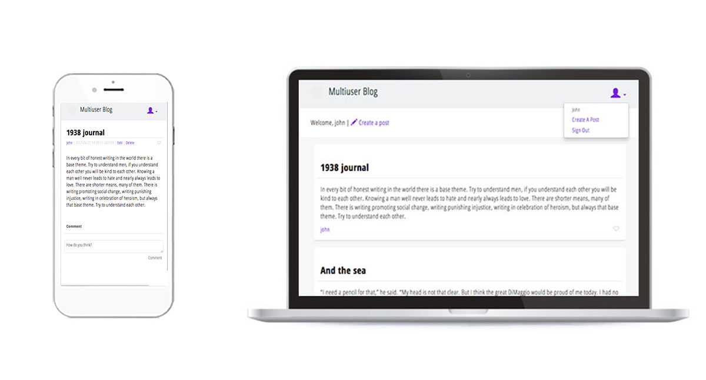

It's a  *note sharing* web app template, using [Google App Engine with Python](https://cloud.google.com/python/) and a Python template engine, [Jinja2](http://jinja.pocoo.org/).

This app includes..
- Default pages to show all or individual notes
- About page as app introduction
- Sign up/sign in function
- Add/Edit/Delete notes function


## File structure
- `src`: Resource folder
  - `app.yaml`: yaml file for Google App Engine
  - `notes.py`: Python to generate blog platform, including sisn up, login, post, handling database.
  - `css`: This folder inludes css file(s) for the generated site pages.
  - `sass`: This folder includes sass file(s) to write css files.
  - `img`: This folder includes image files for the generated site pages. 
  - `templates`: This folder includes templates html files for the generated site pages.
- `img`: This folder includes image files for this README.
- `Gruntfile.js`: It is to compile sass to css.
- `Gruntfile.yml`: Same as the above.
- `node_modules`: Same as the above.
- `package-lock.json`: Same as the above. 
- `package.json`: Same as the above.
- `README.md`
- `LICENCE.md`

## Set up
1. Install [Google Cloud SDK for Python](https://cloud.google.com/sdk/docs/quickstart-mac-os-x)
    * Make sure that you can use gcloud command
2. Run app locally with the following command in `src` folder.
```    
$ dev_appserver.py .
```
3. Check running at
- Module "default" running at: http://localhost:8080. 
- Admin server at: http://localhost:8000.

4. Install [Grunt](https://gruntjs.com/), if you want to use `Gruntfile.js` to run sass compiler.

## Usage

### [SECURITY] Modify hash codes for Security
Modify the following in `notes.py` in `src`. 

##### Set SALT
```
RANGE = 5
```

##### Set SECRET
```
SECRET = 'your_secret_key'
```

##### Can change hash library
You can change hash method. For example, around these codes.
```
def hash_str(s):
    return hmac.new(SECRET, s).hexdigest()
``` 
or 
```
h = hashlib.sha256(name+pw+salt).hexdigest()
```

### Basic Branding

##### Set logo
Replace `0\_logo.svg` in `src`/`img` with your logo file with the same name.

##### Set name
Modify *sitename* variable in `notes.py`  
```
sitename = 'Your blog name'
```

##### Set color
Modify *$color_brand* in `style.scss` in `sass` 


### Database
This app as a default has 2 entity kinds: Note and User

```
class User(db.Model):
    name = db.StringProperty(required=True)
    pw_hash = db.StringProperty(required=True)
    email = db.StringProperty()
```
```
class Note(db.Model):
    name = db.StringProperty(required=True)
    title = db.TextProperty(required=True)
    content = db.TextProperty(required=True)
    created = db.DateTimeProperty(auto_now_add=True)
    last_modified = db.DateTimeProperty(auto_now_add=True)
```
db.Model is inherited from [Model Class](https://cloud.google.com/appengine/docs/standard/python/datastore/modelclass).


## Deploy App Engine
1. Direct to `src` in terminal (if Mac).
2. Run the following command.
```
$gcloud app deploy
```
3. Follow the instruction to choose account, project to deploy.

## License
[MIT License](https://choosealicense.com/licenses/mit/) © [Yukino Kohmoto](http://yukinokoh.github.io/)

